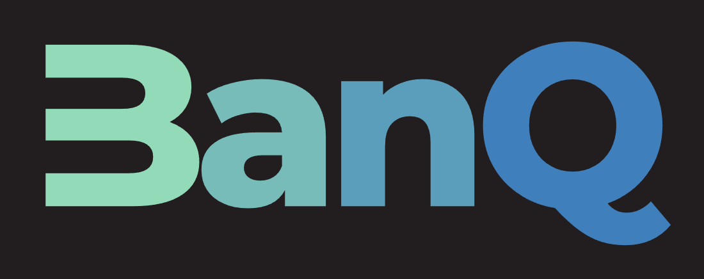
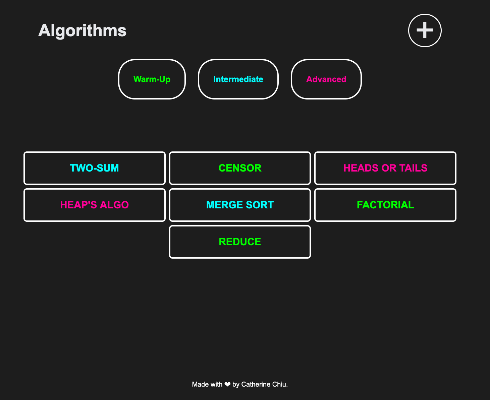

<div align="center">




[](https://github.com/catherinechiu/BanQ)


[](https://github.com/catherinechiu/BanQ)

<p><b>BanQ: </b>An app to crowd-source algorithm solutions in both video explanations and code form.</p>

</div>


## Table of Contents

* [About the Project](#about-the-project)
  * [Built With](#built-with)
* [Getting Started](#getting-started)
  <!-- * [Prerequisites](#prerequisites) -->
  * [Installation](#installation)
* [Usage](#usage)
* [Roadmap](#roadmap)
* [Contributing](#contributing)
* [License](#license)
* [Contact](#contact)
* [Acknowledgements](#acknowledgements)


### Built With

* [React](https://reactjs.org/)
* [React Router](https://reactrouter.com/)
* [Node](https://nodejs.org/en/)
* [Express](https://expressjs.com/)
* [MongoDB](https://www.mongodb.com/)
* [Webpack](https://webpack.js.org/)
* [CodeMirror](https://codemirror.net/)


<!-- GETTING STARTED -->
## Getting Started

Coming soon!

### Installation

1. Fork the repo
2. Clone the repo
```sh
git clone https://github.com/your_username_/BanQ.git
```
3. Install NPM packages
```sh
npm install
```
4. npm start
```JS
npm start
```


<!-- USAGE EXAMPLES -->
## Usage

<div align="center">
 <br /><br /><p></p>
</div>


## Roadmap

See the [open issues](https://github.com/catherinechiu/BanQ/issues) for a list of proposed features (and known issues).


## Contributing

Contributions are what make the open source community such an amazing place to be learn, inspire, and create. Any contributions you make are **greatly appreciated**.

1. Fork the Project
2. Create your Feature Branch (`git checkout -b feature/AmazingFeature`)
3. Commit your Changes (`git commit -m 'Add some AmazingFeature'`)
4. Push to the Branch (`git push origin feature/AmazingFeature`)
5. Open a Pull Request

## License
Distributed under the MIT License. See `LICENSE` for more information.

## Contact

<div align="center">
<br/>
<a href="https://github.com/catherinechiu">Catherine Chiu</a>
</div>


[contributors-shield]: https://img.shields.io/github/contributors/othneildrew/Best-README-Template.svg?style=flat-square
[contributors-url]: https://github.com/othneildrew/Best-README-Template/graphs/contributors
[forks-shield]: https://img.shields.io/github/forks/othneildrew/Best-README-Template.svg?style=flat-square
[forks-url]: https://github.com/othneildrew/Best-README-Template/network/members
[stars-shield]: https://img.shields.io/github/stars/othneildrew/Best-README-Template.svg?style=flat-square
[stars-url]: https://github.com/othneildrew/Best-README-Template/stargazers
[issues-shield]: https://img.shields.io/github/issues/othneildrew/Best-README-Template.svg?style=flat-square
[issues-url]: https://github.com/othneildrew/Best-README-Template/issues
[license-shield]: https://img.shields.io/github/license/othneildrew/Best-README-Template.svg?style=flat-square
[license-url]: https://github.com/othneildrew/Best-README-Template/blob/master/LICENSE.txt
[linkedin-shield]: https://img.shields.io/badge/-LinkedIn-black.svg?style=flat-square&logo=linkedin&colorB=555
[linkedin-url]: https://linkedin.com/in/othneildrew
[product-screenshot]: images/screenshot.png